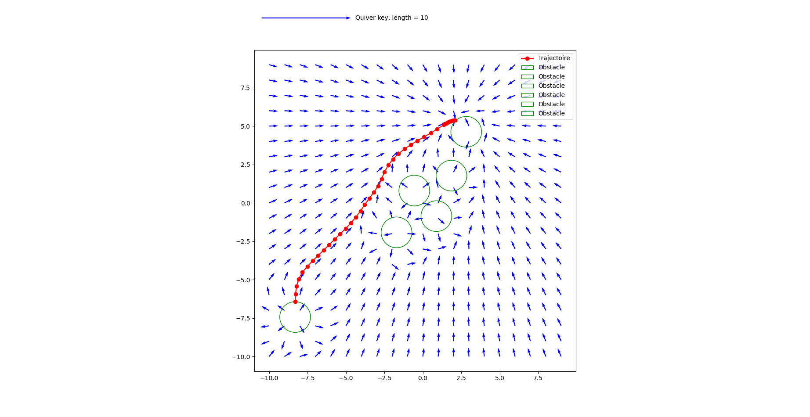

# Optimisation de la position des objets dans la scène afin de faciliter le passage entre deux objets donnés

Ce projet montre qu'il est possible de ré arranger une scene de maniere à ce que deux point données soit reliable par un chemin "correct" en résolvant un problème d'optimisation. Ce principe peut etre ajouté à des logiciels du type layout vlm pour prendre en compte des contraintes sémantiques du type "il faut que cette chaise et cette lampe soit joignable" (ce qui peut ne pas être évidant si la scène est chargée).

Le processus d'optimisation utilise JAX pour minimiser une fonction de perte qui prend en compte qui tente de lié facilement les 2 points. Il faut pour cela que le chemin entre les 2 points soit une fonction différentiables des positions et orientations des objets de la scène ce qui empêche d'utiliser des algos classiques comme a* pour trouver ce chemin. On utilise donc une modélisation par champ de vecteur vitesse, les obstacles repoussant et l'objectif attirant les particules.

## Structure du code

- `get_forces()` : Calcule les forces répulsives et attractives
- `loss()` : Fonction de perte pour l'optimisation de la trajectoire
- `affichage()` : Visualisation de la trajectoire et des champs de force

## Visualisation

Le projet inclut des fonctionnalités de visualisation permettant d'afficher tout au long de la résolution du problème d'optimisation:
- La trajectoire calculée
- Les champs de force vectoriels
- La position des obstacles
- Le point de départ et d'arrivée

Voici l'évolution de l'optimisation à travers différentes étapes :

### Étape 1 : Configuration initiale

*Config initiale*

### Étape 2 : Premières itérations

*Les obstacles commencent à se déplacer pour optimiser la trajectoire*

### Étape 3 : Optimisation avancée

*Les obstacles s'organisent pour créer un passage plus fluide*

### Étape 4 : Configuration finale

*Configuration optimale*
